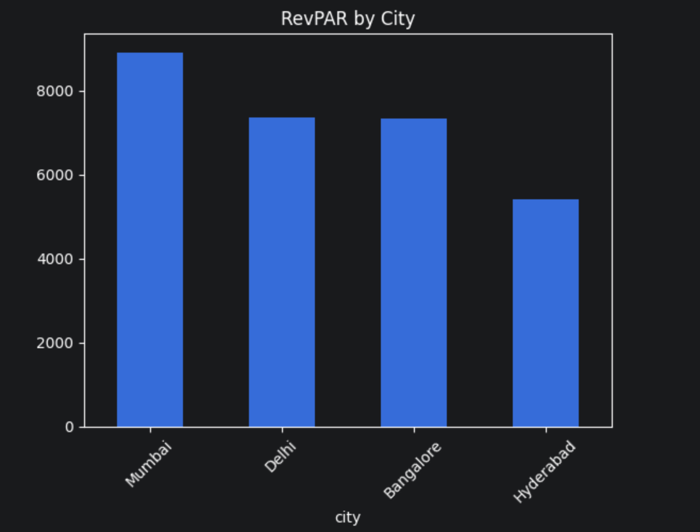
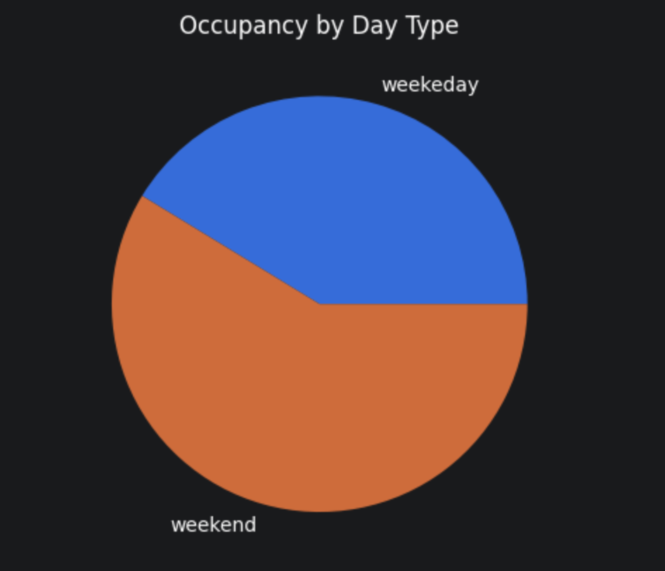
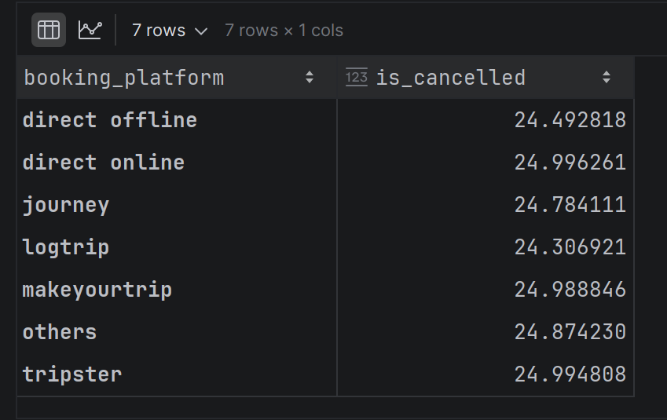
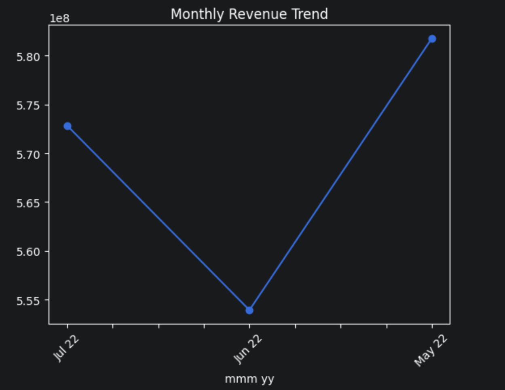

# 🏨 Hospitality Revenue Analytics
### Exploratory Data Analysis | Codebasics Data Analytics Bootcamp

---

## 📌 Overview
This project analyzes hotel booking data across four Indian cities
to understand what drives revenue performance.
The goal is to find patterns in occupancy, pricing, and cancellations
that help a hotel business make better decisions.

---

## 🧩 Business Problem
A hotel chain operating across Delhi, Mumbai, Bangalore, and Hyderabad
wants to understand:
- Why are some cities performing better than others?
- What is causing a ~25% cancellation rate?
- When is demand highest — and is pricing aligned to it?

---

## 💡 Key Insights
- 🏙️ **Mumbai** is leisure-driven — weekends show strong demand
- 💼 **Delhi** is business-driven — weekdays show strong occupancy
- 📉 **Hyderabad** underperforms on both RevPAR and occupancy
- 📆 **Weekends outperform weekdays** across all cities
- ❌ **~25% cancellation rate** is consistent across all platforms
- 👑 **Luxury segment** generates significantly higher revenue
- 📅 **May peaks, June dips, July recovers** — clear seasonality

---

## 🔍 What I Did
- ✅ Cleaned raw data — handled nulls, fixed data types
- ✅ Calculated KPIs: RevPAR, ADR, Occupancy %
- ✅ Analyzed city-level and room category performance
- ✅ Compared weekday vs weekend demand patterns
- ✅ Studied cancellation trends across booking platforms
- ✅ Identified monthly revenue seasonality

---

## 🛠️ Tools Used

| Tool | Purpose |
|------|---------|
| Python | Core analysis |
| Pandas | Data cleaning and groupby analysis |
| Matplotlib & Seaborn | Charts and visualizations |
| Jupyter Notebook | Analysis environment |

---

## 🗂️ Project Structure

hospitality-revenue-analytics/
│
├── 📁 data/
│   ├── data_dictionary.md
│   └── README.md
│
├── 📁 visuals/
│   ├── revpar_by_city.png
│   ├── occupancy_daytype.png
│   ├── cancellation_rate.png
│   ├── monthly_trend.png
│   └── README.md
│
├── 📁 presentation/
│   ├── hospitality_strategy.pptx
│   └── README.md
│
├── analysis.ipynb
├── .gitignore
├── requirements.txt
└── README.md

---

## 📈 Visuals

### RevPAR by City

### Weekend vs Weekday Occupancy

### Cancellation Rate by Platform

### Monthly Revenue Trend

---

## 🎓 Key Learnings
- How to calculate hospitality KPIs from raw booking data
- How demand patterns differ by city and day type
- How to connect data findings to real business problems
- How to present EDA findings in a decision-ready format

---

## 🔮 Future Improvements
- Add revenue forecasting for peak and off-peak months
- Build an interactive dashboard using Power BI or Tableau
- Deeper room category analysis at city level

---

## ⚠️ Data Availability
Dataset provided by **Codebasics Data Analytics Bootcamp**.
Not shared here due to course distribution restrictions.
Visit [codebasics.io](https://codebasics.io) to access.

---

## Author
- Anshul Chaudhary
- morid648@gmail.com

---

## 📬 Connect
[LinkedIn](https://www.linkedin.com/in/anshul-chaudhary-508138308)
[GitHub](https://github.com/morid648)
